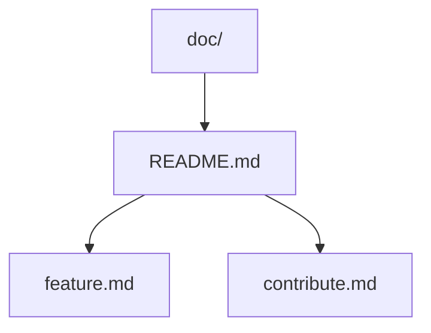

# Features

This module allows to expose a directory where are located md files and render them thanks to a local http server.

Server render the markdown like the github style.

## Basic html rendering

The **blod** and *italic* are provided

|       | table |
| -     | -     |
| row 1 | 10    |
| row 2 | 20    |

List:
 - Item 1
 - Item 2
 - Item 3

so on ...

## Code highlight

It's possible to write code and obtain a colored code like following:

```js
var fs = require(fs);

if (fs.existsSync('path/to/file')) {
    console.log(fs.readSync('path/to/file').toString('utf-8'));
}
```

## Support mermaid graph

Moreover the module support the mermaid syntaxe like following:

````markdown

````

Which render the following graph:


## Support images

Inline-style:  


Reference-style:  
![Markdown logo][logo]

[logo]: ./markdown.png "The markdown logo by reference"
